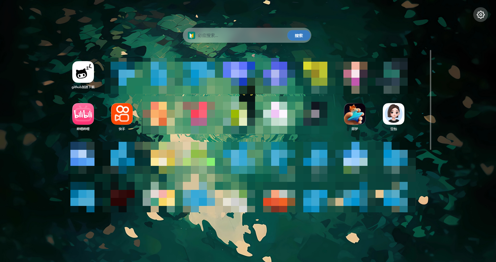

自制谷歌浏览器主页

# 🏠 自定义新标签页 (Custom New Tab)

一款轻量、美观的浏览器新标签页替代插件。集成必应搜索、动态壁纸系统与灵活的标签管理，让您的每一次新开标签页都赏心悦目。

## ✨ 核心功能

- **🔍 必应搜索**：首页搜索框一键直达必应。
- **🖼️ 动态壁纸系统**：
  - 支持 **图片**（JPG/PNG）与 **视频**（MP4/WebM）格式。
  - 壁纸数据存入浏览器 IndexedDB，重启浏览器后自动恢复。
- **📌 智能标签管理**：
  - 左键点击标签：新窗口打开网页。
  - 右键点击标签：弹出操作菜单（**置顶**、**重命名**、**删除**）。
- **🎨 图标自定义**：
  - 可为特定标签名称设置专属图标（PNG/JPG）。
  - 未匹配的标签自动尝试加载 `/icon/` 目录下的同名图标，若不存在则显示占位符。
- **💾 数据导入 / 导出**：
  - **导出**：将所有标签生成为精美的 HTML 书签文件（带复制链接功能）。
  - **导入**：支持将之前导出的 HTML 文件完整恢复，快速迁移数据。

## 📦 安装指南

1. **下载源码**：将本项目所有文件下载到本地文件夹。
2. **打开扩展管理页**：
   - Chrome / Edge 浏览器地址栏输入 `chrome://extensions/` 并回车。
   - 开启右上角的 **“开发者模式”**。
3. **加载扩展**：
   - 点击 **“加载已解压的扩展程序”**。
   - 选择包含 `manifest.json` 的项目文件夹。
4. **完成**：打开新标签页即可体验。

## 📁 项目结构
├── manifest.json # 扩展清单（Chrome Manifest V3）
├── index.html # 主页面 HTML 结构
├── style.css # 全局样式与动画
├── script.js # 核心交互逻辑（搜索、壁纸、标签、导入导出）
├── icon/ # （可选）存放标签默认图标，命名需与标签名称一致
│ └── example.png
└── README.md # 项目说明文档

## 🖱️ 使用说明

| 操作 | 说明 |
| :--- | :--- |
| **搜索** | 输入关键词后点击“搜索”按钮或按 `Enter` 键。 |
| **添加标签** | 点击右上角 **⚙️ 设置齿轮** → **“自定义标签”**，填写名称和网址。 |
| **管理标签** | 在任意标签上 **右键单击**，唤出管理菜单（置顶/重命名/删除）。 |
| **更换壁纸** | 点击 **⚙️ 设置** → **“更换壁纸”**，选择图片或视频文件。 |
| **图标定制** | 点击 **⚙️ 设置** → **“图标设置”**，添加标签名称并上传对应图标即可自动匹配。 |
| **数据迁移** | 点击 **⚙️ 设置** → **“导出网址”** 备份；或 **“导入网址”** 恢复。 |

## 🛠️ 技术实现 & 数据存储

- **localStorage**：存储标签列表 (`customTabs`)、图片壁纸 (`customWallpaper`) 及图标映射 (`iconSettings`)。
- **IndexedDB**：存储视频壁纸文件（`WallpaperDB`），突破 localStorage 的大小限制，确保大体积视频壁纸流畅运行。

## ❓ 常见问题

**Q：导入书签时提示“未找到有效数据”？**  
A：请确保导入的是本扩展导出的标准 HTML 文件，其他格式或手动编辑的结构可能无法被解析。

---

**Enjoy your new tab! 🚀**  
